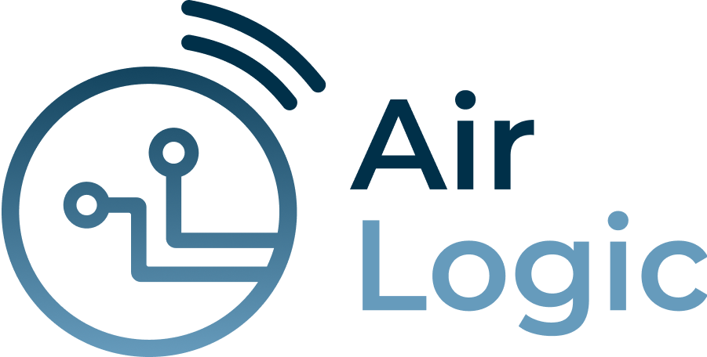

<div align="center">
  
</div>

<br>
<br>

<div align="center">
  <a href="#colaboradores">Participantes</a> •
  <a href="#pré-requisitos">Pré-requisitos</a> •
  <a href="#instalação">Instalação</a> •
  <a href="#rodando-o-projeto">Rodando o Projeto</a> •
  <a href="#uso">Como usar</a>
</div>

<br>
<br>

> Aplicativo mobile focado na visualização e análise de dados sensoriais de sistemas pneumáticos. Ele permite acompanhar, em tempo real ou por histórico, as leituras de pressão captadas por sensores, organizando os dados em gráficos interativos e listas por data.

<h2 id="colaboradores">🤝 Colaboradores</h2>


| Nome                              | RM       |
|-----------------------------------|----------|
| Lucas Camargo de Souza            | RM551898 |
| Kenzo Schiavone Inoue dos Santos  | RM99890  |
| Pedro Daniluz                     | RM97697  |
| Roberto Tetsuo Tagashira          | RM551838 |
| Sofia Barbosa de Souza            | RM552298 |

<h2 id="pré-requisitos">💻 Pré-requisitos</h2>

- [Node.js](https://nodejs.org/)
- [Expo CLI](https://docs.expo.dev/get-started/installation/)
- [Gerenciador de pacotes: [npm](https://docs.npmjs.com/downloading-and-installing-node-js-and-npm) ou [yarn](https://classic.yarnpkg.com/lang/en/docs/install/#windows-stable)]

<h2 id="instalação">🚀 Instalação</h2>

Clone o repositório:

```bash
git clone https://github.com/pedrodaniluz/airlogic.git
cd airlogic
```

Instale as dependências:

```bash
npm install
# ou
yarn
```

<h2 id="rodando-o-projeto">☕ Rodando o Projeto</h2>

1. Instale o Expo CLI globalmente, se ainda não tiver:

    ```bash
    npm install -g expo-cli
    ```

2. Inicie o projeto:

    ```bash
    npx expo start
    ```

3. Use o aplicativo [Expo Go](https://expo.dev/client) no seu dispositivo móvel ou um emulador/simulador para visualizar o app.

4. **Recomendação:** Para melhor compatibilidade visual e funcional, utilize um emulador Android/iOS (como Android Studio ou Xcode) ou um dispositivo físico conectado via USB. A execução via navegador (Web) pode apresentar problemas de estilização em algumas dependências e não é recomendada para testes completos.

5. Para criar e gerenciar emuladores Android (AVDs), consulte a [documentação oficial do Android Studio](https://developer.android.com/studio/run/managing-avds?authuser=1&hl=pt-br).

6. Para criar e gerenciar simuladores iOS, utilize o Xcode no macOS. Consulte a [documentação oficial da Apple](https://developer.apple.com/documentation/xcode/running-your-app-in-simulator-or-on-a-device).

> **Observação:** Certifique-se de que todas as dependências estejam instaladas e o ambiente configurado corretamente.

<h2 id="uso">🕹️ Como usar</h2>

Após iniciar o app, você terá acesso às seguintes funcionalidades principais:

- **Tela Inicial:**  
  Visualize um resumo dos dados sensoriais mais recentes captados pelos sensores de pressão.

- **Gráficos Interativos:** 
  - Ao clicar no histórico de leituras (no card da tela inicial), você será direcionado para uma tela com gráficos dinâmicos que mostram as variações de pressão ao longo do tempo. 

- **Lista de Leituras:**  
  - Consulte todas as medições registradas, organizadas por data e hora.
  - Toque em um item para ver detalhes completos da leitura.

- **Atualização em Tempo Real:**  
  - Caso o app esteja conectado a sensores ativos, visualize as leituras em tempo real.
  - Os dados são atualizados automaticamente conforme novas medições são recebidas.

> **Observação:** Os dados são fictícios e são recebidos do backend, que deve estar em execução local na porta 8080. Clique <a href="https://github.com/PedroDaniluz/airlogic-api">aqui</a> para ser redirecionado ao repositório com o backend.
